<div align="center">

<h1>揭开黑箱 · Black Box</h1>

<p><b>和真实的开源大模型聊天，然后像调试程序一样，一层层揭开它，看它是怎么想出每一个字的。</b></p>

<p>
<a href="https://caijiechao.com/blackbox/"></a>
</p>

<p>


</p>

<a href="https://caijiechao.com/blackbox/"></a>

<sub>拆开第 24 层：输入向量乘上 W<sub>q</sub> / W<sub>k</sub> / W<sub>v</sub> 三块真实权重（面板的明暗就是这一层真实的权重分布）</sub>

<p>
<a href="https://caijiechao.com/blackbox/"><b>▶ 在线体验</b></a>
&nbsp;·&nbsp; <a href="#五个页面">五个页面</a>
&nbsp;·&nbsp; <a href="#为什么说它是真的">为什么说它是真的</a>
&nbsp;·&nbsp; <a href="#一层层揭开">一层层揭开</a>
&nbsp;·&nbsp; <a href="#延伸学习">延伸学习</a>
&nbsp;·&nbsp; <a href="#架构">架构</a>
&nbsp;·&nbsp; <a href="#本地运行">本地运行</a>
&nbsp;·&nbsp; <a href="#推理视频">推理视频</a>
</p>

</div>

> **In English** — *Black Box* is an interactive, debugger-style walkthrough of a real open-source LLM. Chat with **Qwen3-0.6B**, then press **＋** to step *into* it: from a closed box, through 28 transformer layers and their operators, down to a single multiply-add and the 16 bits of one bf16 weight. Every number on screen comes from an offline run of the real model; the browser only replays it. Sibling pages cover **training** (a tiny Qwen3-style poetry model trained from scratch, plus three real SFT steps on Qwen3-0.6B), **vision** (where Qwen3-VL-2B looks while it writes each word), a **coding agent** (Qwen3-4B recorded in a real sandbox), and a **world model** (a small V + M model in the style of Ha & Schmidhuber's *World Models*, trained here and run live in the browser: drive inside its dream next to the real game). Pure static site, no build step, Three.js r186. The UI is in Chinese.

## 五个页面

顶栏导航互通，交互方式一致：**点选输入 → 流式回答 → ＋ 逐层揭开 → 调试器式播放**（世界模型页把前两步换成了“开车”）。数据都来自真实模型的离线运行；世界模型页是自己训练的小模型，用真实权重在浏览器里现场算。

<table>
<tr>
<td width="50%" valign="top">

### [推理](https://caijiechao.com/blackbox/) · Qwen3-0.6B

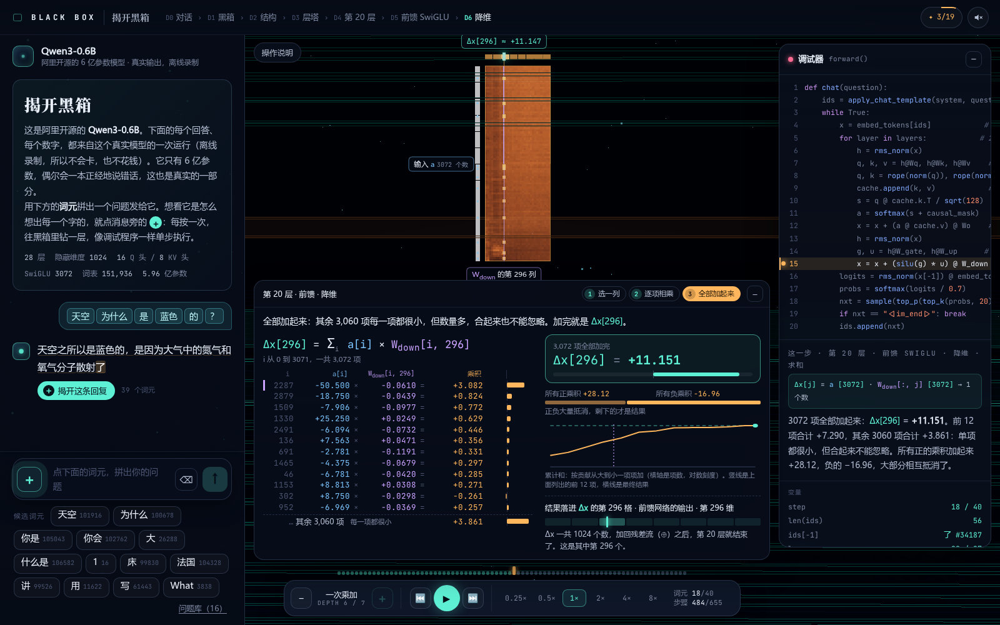

<sub>D6 一次乘加：第 20 层前馈降维的一个输出，3,072 项乘积加起来正好是真实结果</sub>

- 点选式输入法拼问题，候选就是问题的**真实分词**（Qwen3 的词元和编号），模型像平常的 AI 一样流式回答
- 点 ＋ 单步进入，**D1 黑箱 → D7 比特**一共七层；播放 / 单步 / 0.25×–8× 倍速，伪代码高亮、变量监视
- **算式板**把一个数写成 y[j] = Σ x[i] × W[i, j]：前 12 项逐项相乘，其余项合成一行，正负乘积之和、累计和曲线
- **全部 28 层**、每个生成的词元都有真实乘加；D7 点任意一个 bf16 比特翻转，精确重算
- **英文版**：顶栏 中 / EN 切换（或网址加 `?lang=en`），界面、讲解、知识碎片都有英文；英文的 14 个问题是 Qwen3-0.6B 用英文系统提示**另跑的一批真实运行**（`export_qwen.py --lang en` → `public/data/en/`，采样参数和种子规则同中文），不是把中文回答翻译过去

</td>
<td width="50%" valign="top">

### [训练](https://caijiechao.com/blackbox/train/) · 从零预训练 + SFT

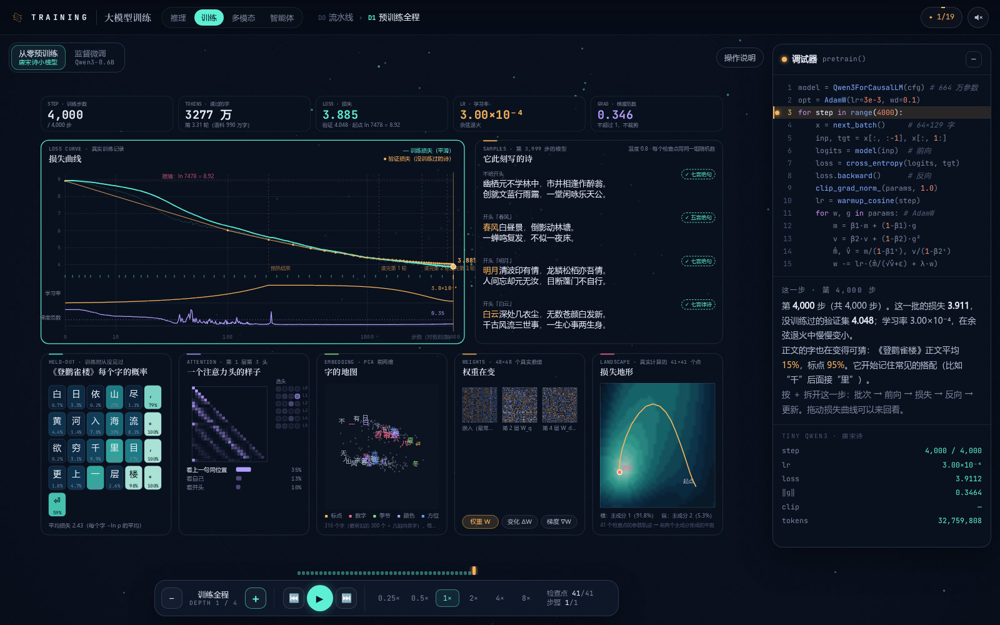

<sub>训练全程：唐宋诗小模型第 4,000 步的仪表盘</sub>

- 从零训练一个和 Qwen3 **同构**的唐宋诗小模型：664 万参数、4,000 步，在一块 RTX 5090 上真实跑完
- 损失 / 学习率 / 梯度范数，此刻写的诗，没见过的《登鹳雀楼》逐字概率，注意力头，嵌入 PCA，损失地形
- 在 **Qwen3-0.6B** 上真实走三步全参数 SFT，回答的损失 5.02 → 1.38 → 0.52 → 0.011
- 一路拆到一个数：一个位置的交叉熵、一层 7 个矩阵的梯度、一个权重的 AdamW 算式和 fp32 / bf16 比特

</td>
</tr>
<tr>
<td width="50%" valign="top">

### [多模态](https://caijiechao.com/blackbox/multimodal/) · Qwen3-VL-2B

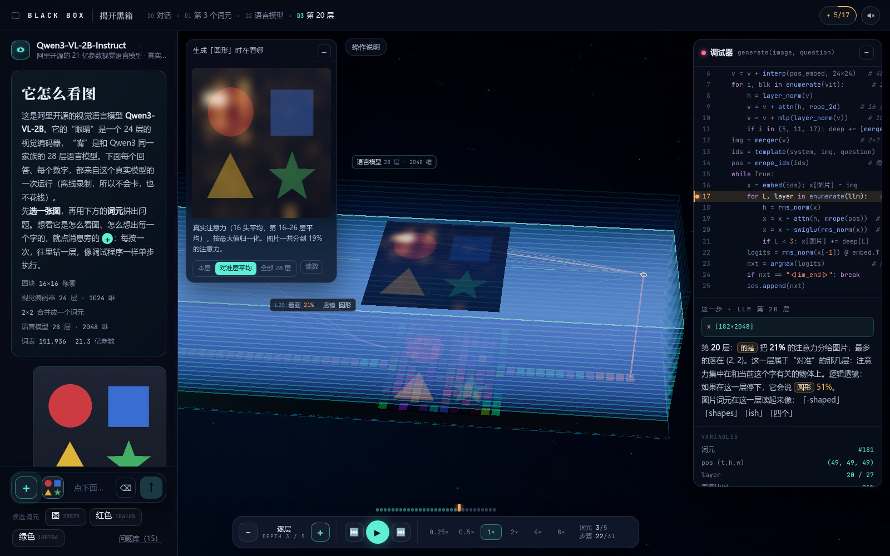

<sub>问“红色的是什么形状？”，生成「圆形」时，注意力落在红色的圆上</sub>

- 先选图、再点选提问；回答完把鼠标放在字上，图上亮起生成这个字时**真实的注意力**
- 缩放、切成 16×16 图块、ViT 24 层（每层特征按主成分着色）、2×2 合并、DeepStack、M-RoPE 三维位置
- 语言模型 28 层逐层热力图；实测第 16–26 层对准物体的**富集倍数 3–5 倍**，更浅的层基本不看物体
- 一次乘加：一个图块的 1,536 个输入乘第 c 个卷积核再加偏置，得到嵌入的一个数

</td>
<td width="50%" valign="top">

### [智能体](https://caijiechao.com/blackbox/agent/) · Qwen3-4B

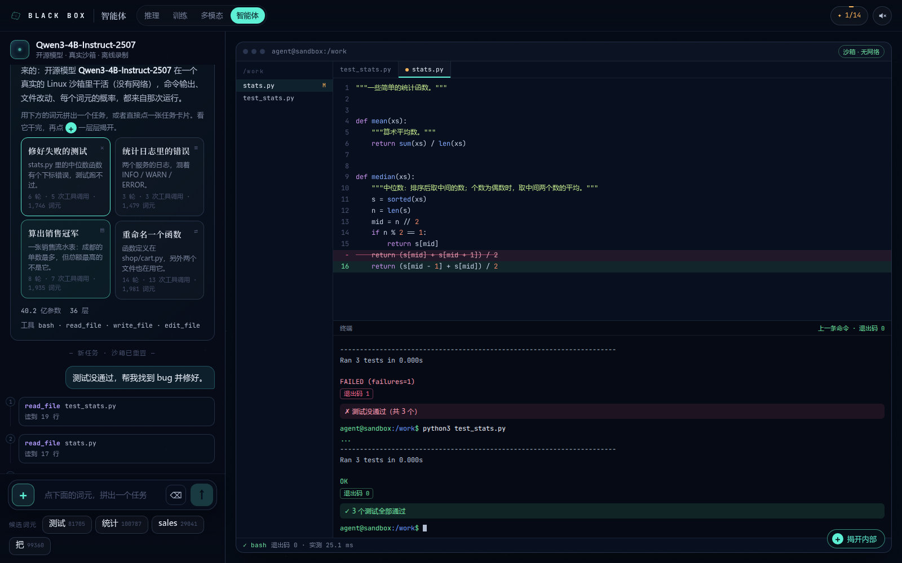

<sub>修好失败的测试：编辑器里的 diff，终端里的测试由红转绿</sub>

- **模型 + 工具 + 循环**：Qwen3-4B 在 bubblewrap 沙箱里真实录制的编程 agent（断网、只能写 `/work`）
- 4 个任务：修测试、统计日志、算销售冠军、重命名函数；每条轨迹都在沙箱里**独立检查**是否真的完成
- 揭开后看 agent 循环、每一圈的整段上下文和 KV 缓存复用、逐词元的前 5 名候选、36 层前向
- 轨迹保留了模型自己犯错再纠正的过程：`python` 不存在就换 `python3`，装不了 pandas 就改用 csv 模块

</td>
</tr>
<tr>
<td width="50%" valign="top">

### [世界模型](https://caijiechao.com/blackbox/world/) · 自己训练的 V + M

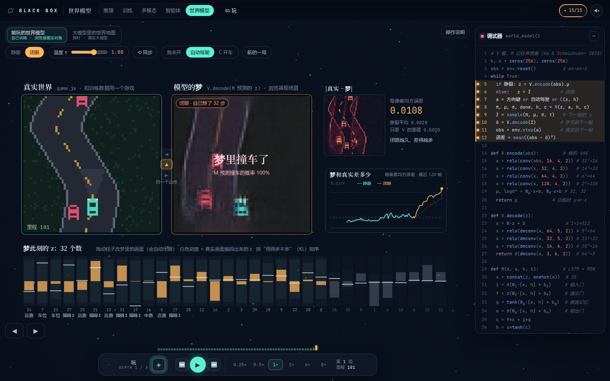

<sub>闭眼 32 步：左边是真实的游戏，右边是模型自己往下想的梦——路已经弯得不一样了，梦里还撞上了一辆它自己编出来的车</sub>

- 一个确定性的小游戏「夜路」（64×64，3 个动作），Python 和 JS 各一份整数实现，**逐像素一致**
- 照 Ha & Schmidhuber 2018《World Models》在 RTX 5090 上**真实训练**：V（卷积 VAE，z = 32）+ M（LSTM 256 + 5 个高斯的混合密度）+ C（线性，只在梦里用 CMA-ES 训练），39 万帧，全流程约 8 分钟
- 网页下载**真实权重**（float16，3 MB），纯 JS 现场前向，和 PyTorch 逐元素核对；你开车，梦和真实世界用同一个动作并排跑：睁眼 / 闭眼、温度 τ、拖 32 根潜变量柱子改梦、让 C 在梦里开
- 一路拆到一个数：循环、V 的每一层特征图和潜空间逐维扫描、LSTM 的门和混合密度、一次乘加

</td>
<td width="50%" valign="top">

### 世界模型 · V 的内部

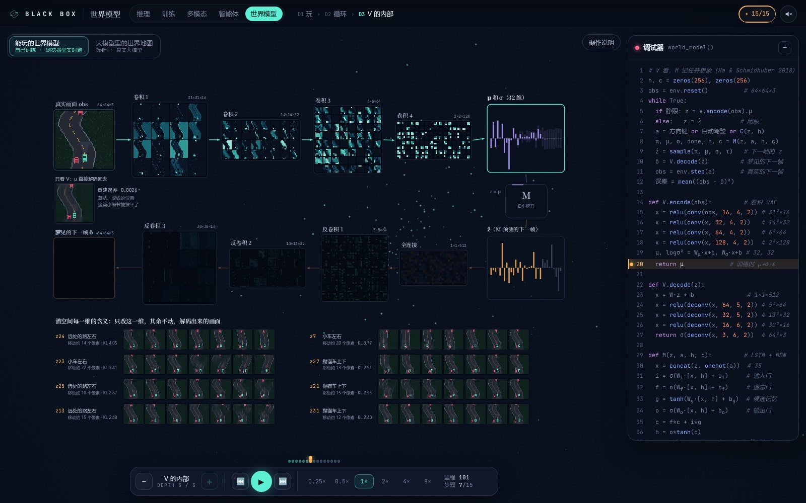

<sub>D3 V 的内部：这一帧真实算出来的每一层特征图；下面把用得最多的 8 维各扫一遍——有的管路往哪弯，有的管小车左右，有的管抛锚车在哪</sub>

- 编码器 4 层卷积（每层 16→128 个特征图）、μ / σ、z；解码器全连接 + 4 层反卷积，层层都是浏览器里现场算的真实激活值
- 32 维里用上了 23 维；每一维“管什么”是导出时在解码画面上量出来的（小车、三段路、抛锚车跟着动了几个像素）
- 点任意一格（或梦里任意一个像素），按 ＋ 看它的 Σ x·w + b：最多 1,024 项，前 12 项逐项相乘，加起来和前向结果一致

</td>
</tr>
</table>

<table>
<tr>
<td width="50%" valign="top">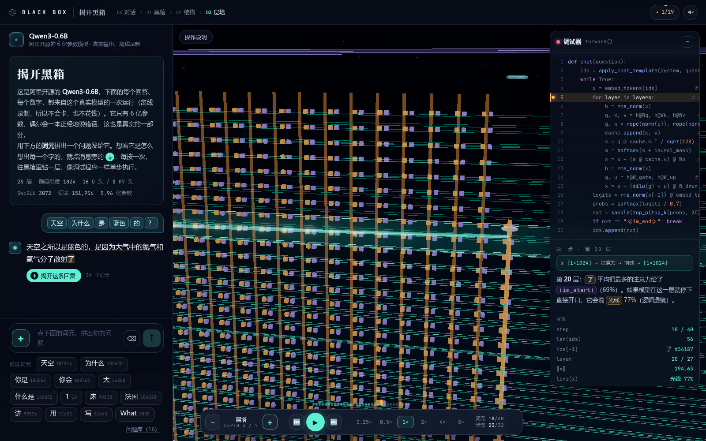<br><sub><b>推理 · D3 层塔</b>：28 层玻璃层板和残差流光柱，调试器里是这一层的逻辑透镜读数</sub></td>
<td width="50%" valign="top"><br><sub><b>训练 · 三步 SFT</b>：“我是黑箱里的小模型。”每个词元的概率被一步步推上去</sub></td>
</tr>
<tr>
<td width="50%" valign="top">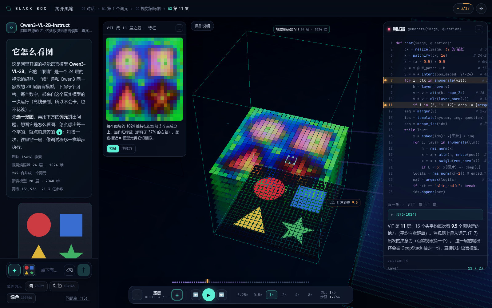<br><sub><b>多模态 · ViT 第 11 层</b>：每个图块的 1024 维特征投到前 3 个主成分，当作红绿蓝</sub></td>
<td width="50%" valign="top">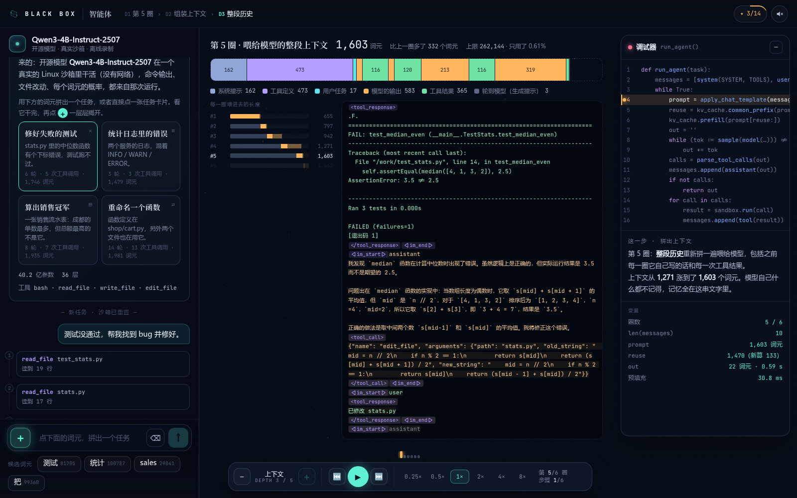<br><sub><b>智能体 · D3 上下文</b>：第 5 圈喂给模型的 1,603 个词元，按来源分段，越滚越长</sub></td>
</tr>
</table>

## 为什么说它是真的

推理、训练、多模态、智能体四页的网页本身不跑模型：所有数字都是先在本地 GPU 上用**真实的开源权重**跑出来、导出成静态文件，浏览器只负责回放和讲解。世界模型页例外——模型小到可以在浏览器里实时跑，所以网页下载它的真实权重，每一帧现场算。

- **真实推理**：推理页用 Qwen3-0.6B 的非思考模式（T=0.7 / top_k=20 / top_p=0.8，固定种子），连各温度下的概率、top-k / top-p 候选池和采样用的随机数都导出了，网页上的每一次抽签用的都是这些真实数值；多模态页贪心解码；智能体页用 Qwen3-4B-Instruct-2507，同样的采样参数。
- **自己复现，和模型核对**：推理导出脚本自己复现一遍注意力（RMSNorm → RoPE → GQA），和模型输出的平均误差约 3×10⁻⁴；多模态脚本复现 ViT 的 qkv → 2D RoPE → softmax，平均相对误差约 4×10⁻³；训练脚本按公式重算 AdamW 的中间量，误差在 5 个 fp32 ulp 以内。
- **加得起来**：D6 算式板上，前 12 项加上“其余 N−12 项”的汇总，正好等于真实结果；D7 翻转一个比特，旧权重 → 新权重、旧输出 → 新输出都是精确重算的。
- **说错也照录**：Qwen3-0.6B 只有 6 亿参数，偶尔会一本正经地说错，这也是真实的一部分；智能体每条轨迹录完都在沙箱里独立检查，没通过就换下一个随机种子重录，所有尝试（包括失败原因）写进 manifest，页面上如实显示。
- **世界模型是自己训练、在浏览器里现场算的**：世界模型页的 V / M / C 是在本地 RTX 5090 上用 39 万帧真实游戏画面训练出来的，网页下载的就是这份权重，每一帧的梦都由浏览器里的 JS 前向现场算出（不是录像）。JS 前向和 PyTorch 用同一份 float16 权重逐元素核对：最大绝对误差 2.1×10⁻⁵（激活值最大约 43），梦见的画面（0–1）最大误差 2.6×10⁻⁶；“一次乘加”的算式板再用双精度把 n 项重新加一遍，和前向的值差在 10⁻⁶ 量级。游戏有 Python / JS 两份整数实现，60 局 9,370 帧逐像素一致。照论文原样的损失训练，VAE 会把抛锚车整个丢掉，所以重建误差里给抛锚车和小车的像素加了权重、KL 项乘 0.25——这些改动页面上和下文都写明了。
- **示意会标出来**：训练页“偏好对齐 / 强化学习”一段是示意（其中的 DPO 损失是用真实对数概率代入公式算的一次），凡是标“示意”的都不是实测。
- **不冒用商业产品**：智能体页展示的是编程 agent 的通用模式，用的是开源模型在真实沙箱里的真实运行，不模仿任何商业产品的界面或输出。

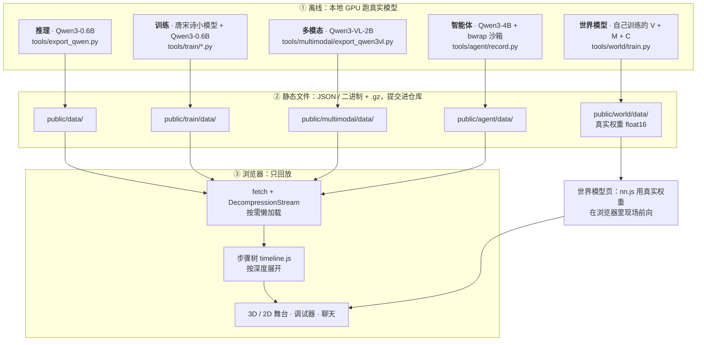

<details>
<summary><b>推理页导出了什么</b>（<code>tools/export_qwen.py</code>）</summary>

为每个预设问题（共 16 个）导出：

- 聊天模板后的真实分词、生成的回答、每一步的前 12 名概率、各温度下的概率、top-k / top-p 候选池和采样用的随机数；
- 逻辑透镜（每层输出接最终 RMSNorm + 输出矩阵）的前 3 名；
- 每层每头的注意力（每行前 4 名）和 logsumexp（用来还原真实打分）；
- 每层 SwiGLU 激活的前 16 名、第 14 层完整的 3072 维；
- **全部 28 层**、每个生成词元的真实乘加：单个 SwiGLU 神经元（这一步激活最大的那个）、一次 Q·K 打分，以及 W_q（含 q_norm、RoPE 前后的值）、W_o、W_down 各一个输出元素；
- 每一步选中词元的 logit 是怎么点积出来的；
- 上面每一次点积除了贡献最大的 12 项，还附带全部 n 项的汇总（n = 1024 / 2048 / 3072 / 128）：正乘积之和、负乘积之和，以及按 |乘积| 从大到小排好后的累加和（在第 1、2、4、…、2048 和第 n 项处采样，最后一个就是真实结果）；
- 每层 7 个权重矩阵的真实分布缩略图（`weights.bin`，每格 32×32 个权重的均方根）；
- 每层每个位置的残差范数。

导出结果在 `public/data/`，数据文件额外存一份 `.gz`，网页用 `DecompressionStream` 解压（服务器只对 HTML 做 gzip），不支持时退回未压缩的版本。

</details>

<details>
<summary><b>训练页怎么训的</b>（<code>tools/train/</code>）</summary>

两段训练都是在本地 RTX 5090 上真实跑出来的，网页只回放导出的记录。

**小模型：从零预训练**

- **论文**：David Ha、Jürgen Schmidhuber，*[World Models](https://arxiv.org/abs/1803.10122)*（2018）。世界模型页的 V / M / C 结构、KL 容忍度、MDN-RNN、温度 τ、在梦里训练控制器都照这篇论文；游戏、数据和训练是本仓库自己做的。
- **语料**：[chinese-poetry](https://github.com/chinese-poetry/chinese-poetry)（MIT 许可，诗歌本身属公有领域）的《全唐诗》《全宋诗》，取自提交 `b8594f8`。用 OpenCC 繁转简，只留“，。”交替的五言 / 七言绝句和律诗，去重，丢掉含低频字（出现不到 3 次）的诗：训练集 215,116 首 / 990 万字，验证集 4,390 首。《登鹳雀楼》被整首留出，训练时从没见过。
- **模型**：transformers 的 `Qwen3ForCausalLM`，改小尺寸：6 层、隐藏维 256、4 个查询头 / 2 个键值头（GQA）、每头 64 维、q_norm / k_norm、RMSNorm、RoPE（θ = 10⁴）、SwiGLU 768、输入输出共享嵌入；字符级词表 7,478（含 `<|endoftext|>`），共 664 万参数。
- **训练**：4,000 步 × 64 行 × 128 字（约 3,277 万字、3.3 轮），AdamW（β = 0.9 / 0.95，权重衰减 0.1，RMSNorm 不衰减），峰值学习率 3e-3、预热 200 步后余弦退火到 3e-4，梯度裁剪 1.0；bf16 autocast 前向，fp32 主权重。训练本身约 3 分钟（含检查点记录共 275 秒），验证损失 8.94 → 4.05。
- **记录**：每一步的损失、学习率、梯度范数；41 个检查点上的生成样例（同一组随机数）、留出诗的逐字概率与所有注意力头、嵌入 PCA（逐帧 Procrustes 对齐）、三块权重和梯度的 48×48 局部、批次第 0 行的逐字损失 / 逻辑透镜 / 残差范数 / 残差梯度 / 更新后重新前向、每个参数张量的梯度范数、4 个权重的完整 AdamW 中间量（脚本会用公式重算一遍核对，误差在 5 个 fp32 ulp 以内）；最后在检查点轨迹的前两个主成分平面上算 41×41 的损失地形（两个主成分解释约 97% 的方差）。

**Qwen3-0.6B：三步 SFT**

主页面用的同一个 Qwen3-0.6B，全参数、fp32。一条“自我认知”对话（“你是谁？”→“我是黑箱里的小模型。”）套上非思考模式的聊天模板（24 个词元），提示部分标签设为 −100，只对回答的 8 个位置算损失；在同一条对话上连走 3 步 AdamW（lr 1e-5，β = 0.9 / 0.95，权重衰减 0.1，裁剪 1.0；m、v 放在内存里，公式与 `torch.optim.AdamW` 相同）。回答的损失 5.02 → 1.38 → 0.52 → 0.011。记录逐词元概率与前 5 名、两种损失（只算回答 / 全都算）、逻辑透镜、残差流梯度、每个参数张量的梯度范数、4 个权重的 g / m / v / 偏差校正 / Δw，以及 3 步后有多少权重存回 bf16 会变回原值（85%）。DPO 一例：新回答和原模型自己的贪心回答，在微调前后的模型上算对数概率，代入 DPO 公式（β = 0.1）。

导出在 `public/train/data/`：首屏只取 `tiny.json` + `tiny.bin` + `qwen.json`（gzip 后共 93 KB），其余按检查点 / 层级拆成小分块按需载入，合计约 1.16 MB gzip（拆分方式见下方“训练页的数据拆分与按需载入”）。

</details>

<details>
<summary><b>多模态页导出了什么</b>（<code>tools/multimodal/</code>）</summary>

`export_qwen3vl.py` 在本地 GPU 上运行 **Qwen3-VL-2B-Instruct**（ModelScope：`Qwen/Qwen3-VL-2B-Instruct`；bf16，eager 注意力，显存约 5 GB），贪心解码，导出到 `public/multimodal/data/`：

- 模型真正看到的像素（从 `pixel_values` 还原）、网格尺寸、聊天模板后的分词、M-RoPE 的 (t, h, w) 位置；
- ViT 每一级的特征主成分颜色、各头平均注意距离、第 0/5/11/17/23 层合并到 2×2 词元分辨率的完整注意力（脚本自己复现 qkv → 2D RoPE → softmax，并和模块输出核对，平均相对误差约 4×10⁻³）；
- 一个图块 → 嵌入一维的真实乘加（像素、卷积核权重、偏置、位置嵌入）和 16 个卷积核；
- 合并器与三路 DeepStack 输出的主成分颜色、长度；图片词元在 LLM 每层之后的逻辑透镜读数；
- 每个生成步：前 8 名候选概率、每层逻辑透镜前 3 名、每层（16 头平均）对每个视觉词元的注意力、对文字的前 4 名、每头分给图片的比例、第 17 / 20 层每个头在图片上的注意力。

`grounding.py` 用几张图上手工标的物体区域，量了“生成某个词时注意力是否落在对应物体上”：第 16–26 层的富集倍数是 3–5 倍，更浅的层基本不看物体，所以网页的总览热力图默认用这几层平均。

数据约 2.5 MB（gzip），另有 7 张图约 0.2 MB。

</details>

<details>
<summary><b>世界模型页怎么训的</b>（<code>tools/world/</code>）</summary>

结构照 Ha & Schmidhuber 2018《[World Models](https://arxiv.org/abs/1803.10122)》，全部在本地 RTX 5090 上真实训练（全流程约 8 分钟，显存峰值 6.6 GB），网页下载的是训练出来的真实权重。

- **游戏「夜路」**（`game.py` / `public/world/js/game.js`）：俯视角，小车在蜿蜒的夜路上开，躲开抛锚的车；画面 64×64（12 色调色板），动作 直行 / 向左 / 向右，每步路面下滚 2 行、小车横移 2 格，撞车或冲出路面就结束。路的弯道和抛锚车由 xorshift32 随机数生成，全程只用整数，Python 和 JS 两份实现同一个种子、同一串动作逐像素一致（`check_game.mjs`：60 局 9,370 帧，画面、启发式司机的选择、结局全部一致）。
- **采集**：4,000 局、389,949 帧——2,500 局由“往前看 20 步”的动态规划启发式司机开（每步有 0–12% 的概率插一段随机动作），1,500 局随机乱开（带惯性）；每局最多 300 步。按局打乱后留出 2% 做测试。
- **V（卷积 VAE）**：编码 Conv 3→16→32→64→128（4×4，步长 2）→ 512 → μ、logσ²（各 32 维）；解码 32 → 512（1×1×512）→ 反卷积 64（5×5）→ 32（5×5）→ 16（6×6）→ 3（6×6），sigmoid。和论文同一结构、通道数减半（浏览器里一次编码 + 解码约 15 ms），111 万参数。损失是逐像素平方和 + KL（容忍度 0.5×32，同论文）；照论文原样训练时 VAE 把抛锚车整个丢掉（一辆只有 31 个像素，32 维里只用上 8 维），所以抛锚车的像素权重 ×6、小车 ×2，KL 乘 0.25（β-VAE），用上了 23 维。30 轮、Adam + OneCycle（峰值 1e-3）、批 256，184 秒；测试集每像素均方误差 0.0021。
- **M（MDN-RNN）**：LSTM（输入 [z, 动作 one-hot] 35 维，隐状态 256）+ 全连接到每一维 5 个高斯（log π、μ、log σ）和一个“这一步撞车了吗”的 logit（论文 Doom 实验的做法），42 万参数。输入的 z 每次从 N(μ, σ²) 重新采样（同论文），损失是混合密度负对数似然 + 撞车的加权交叉熵；2 万步 × 256 条 × 96 步，157 秒；测试集撞车预测的召回 76%、精确率 73%。
- **C（控制器）**：a = argmax(W [z, h, 1])，867 个参数，用（对角协方差的）CMA-ES **只在 M 的梦里**训练（论文 Doom 实验的做法）：每代 64 个候选、每个在梦里开 16 局 300 步，温度 τ = 1.15，撞车概率超过 50% 算这一局梦结束；200 代，56 秒。拿到真实游戏里检验（30 局）：平均开 65 步，随机乱开 20 步、一直直行 38 步、启发式司机能开满 1,000 步——梦里学会了一点，但远不如看得见真实路面的司机。
- **导出**（`export_world.py`）：权重存 float16（3.0 MB，gzip 只能压 7%，不另存 .gz），再读回来做所有参考输出；`model.json` 里有训练记录和损失曲线、潜变量每一维的统计、每一维“扫一遍”的测量（以 32 帧的 μ 为底，把这一维从数据里的 1% 分位扫到 99% 分位，在解码画面上量小车、三段路的中心、抛锚车跟着动了多少）、测试集上梦与现实的平均差异（30 局：睁眼一步预测每像素均方误差约 0.0021–0.0028；闭眼 10 步约 0.0043、30 步约 0.0079、60 步约 0.0099；只看 V 的重建 0.0020）。
- **浏览器里**（`public/world/js/nn.js`）：卷积、反卷积、全连接、LSTM、混合密度采样都是纯 JS + typed array（float32），和 PyTorch 的张量排布一致；`check_nn.mjs` 用同一份权重和 PyTorch 的 float32 / float64 前向逐元素核对（16 个张量，大的等间隔抽样约 3,000 个元素）：最大绝对误差 2.1×10⁻⁵，输出画面最大误差 2.6×10⁻⁶。无头 Chromium（CPU）里一次编码 6.3 ms、解码 8.9 ms、LSTM 一步 0.3 ms；D1 的 1× 是每秒 20 帧（实测 20.2）；8× 时睁眼每一帧都要编码，受 CPU 限制实测每秒约 100 帧，闭眼时跑满每秒 160 帧。

</details>

<details>
<summary><b>智能体页录了什么</b>（<code>tools/agent/record.py</code>）</summary>

- **模型**：`Qwen3-4B-Instruct-2507`（bf16，约 8 GB 显存），非思考模式，T=0.7 / top_k=20 / top_p=0.8。先试过 `Qwen3-1.7B`：“算出销售冠军”和“重命名一个函数”两个任务换了 3 个随机种子都没做完（反复执行同一条命令、改不到所有引用），所以换成了能稳定完成的 4B。
- **沙箱**：每个任务把 `tools/agent/sandbox/<任务>/` 复制到临时目录，用 bubblewrap（`bwrap`）挂成 `/work`：系统目录只读、只能写 `/work`、`--unshare-all` 断网、清空环境变量、每条命令 10 秒超时。
- **工具**：`bash`、`read_file`、`write_file`、`edit_file`（字符串替换，原文必须恰好出现一次）。系统提示里写了工作方式和工作目录里的文件列表。
- **任务**：修好失败的测试（`fix-median`）、统计日志里的错误（`log-errors`）、算出销售冠军（`sales-top`）、重命名一个函数（`rename-func`）。每条轨迹录完后，脚本在沙箱里**独立检查**是否真的完成（跑测试、核对数字、确认测试文件只改了名字、脚本真的跑通），没通过就换下一个随机种子重录；尝试记录（包括失败原因）都写进 manifest，页面上如实显示。
- **录下来的真实信号**：每一轮聊天模板渲染后的完整上下文和真实词元数（按消息分段）、与上一轮相比能复用的 KV 缓存长度（真的用 `DynamicCache.crop` 复用）、逐词元输出和每个词元前 5 名候选概率、候选池大小、解析出的工具调用、沙箱里的命令输出 / 退出码 / 耗时、每次工具调用前后的文件快照与 diff、预填充与生成的实测耗时。

数据在 `public/agent/data/`（`manifest.json` + 每个任务一个 JSON，另存 `.gz`，合计约 70 KB gz）。

</details>

## 一层层揭开

推理页的核心玩法：在聊天里点消息旁的 **＋**，右侧出现一台 3D 机器。每按一次 ＋ 往里钻一层（单步进入），− 退回（跳出）；同一个深度里用上一步 / 下一步逐步执行。

| 深度 | 看到什么 | 每一步是什么 |
| :-- | :-- | :-- |
| **D1** 黑箱 | 合着的机箱，想完一个词就吐出一块 | 每个词元一步 |
| **D2** 结构 | 机箱揭开：词元托盘、28 层玻璃层板、残差流光柱、lm_head、采样轨道、自回归回路 | 读入 / 嵌入 / 28 层 / 输出头 / 采样 |
| **D3** 层塔 | 每层旁边有逻辑透镜读数，层板上有 KV 缓存和注意力光束 | 逐层 |
| **D4** 一层之内 | 拆开的一层：RMSNorm → 注意力 → ⊕ → RMSNorm → SwiGLU → ⊕，权重面板按真实形状等比例 | 逐个算子 |
| **D5** 算子 | 注意力：Q·K·V / 打分 / softmax / 加权求和，16 个查询头可切换；前馈：3072 个神经元阵列 | 算子内部 |
| **D6** 一次乘加 | 矩阵乘法的显微镜 + 算式板：一个输出元素是怎么由 N 项乘积加出来的；28 层每一层、每个生成的词元都有 | 选一列 / 逐项相乘 / 求和 |
| **D7** 比特 | 被放大的那个数的 16 个 bf16 比特，点任意一位翻转，精确重算 | — |

每一步的调试面板都标出真实的矩阵形状（如 `h [1×1024] @ W_q [1024×2048] → q = 16 头 × 128`）；拆开的层里，权重面板的明暗就是这一层真实的权重分布（每格 32×32 个权重的均方根）。一路上藏着 19 个“知识碎片”，右上角的图鉴可以查看。

<details>
<summary><b>D6 一次乘加、D7 比特的完整说明</b></summary>

**D6 一次乘加**：矩阵乘法的显微镜。在真实权重面板上高亮第 j 列，输入（蓝）沿第 i 行走到格子 (i, j)（紫），乘积（橙）顺着这一列飞进输出格（青）。舞台下方的**算式板**把它写成 y[j] = Σ x[i] × W[i, j]：前 12 项逐项相乘、飞进累加器，“其余 N−12 项”合成一行，加起来正好等于真实结果；附正 / 负乘积之和、按贡献排序的累计和曲线，以及结果落进输出向量的哪一格、是什么意思（W_q 另有 q_norm + RoPE 旋转；W_o、W_gate / W_up、W_down、输出头的 logit 同理）；一次 Q·K 打分；SwiGLU 的 SiLU 曲线与乘法阀门。28 层每一层、每个生成的词元都有。

**D7 比特**：被放大的那个数的 16 个 bf16 比特，分成符号 / 指数 / 尾数三组，算式板写出 值 = (−1)^s × 2^(e−127) × (1 + m/128)。点任意一位翻转（舞台键帽或算式板），精确重算：旧权重 → 新权重、旧输出 → 新输出和差值（神经元输出、注意力权重、候选词的概率也一起重算）。在 D6 的乘法这一步点算式板的某一行，就看那一项。

</details>

<details>
<summary><b>操作方式</b>（五个页面通用）</summary>

| 做什么 | 怎么操作 |
| :-- | :-- |
| 播放 / 暂停 | 空格，或底部 ▶ |
| 上一步 / 下一步 | ← → |
| 单步进入 / 跳出 | ＋ −（推理页舞台上也可以点物体直接跳过去） |
| 倍速 | 1–6 键，0.25× – 8× |
| 自由移动（推理页 3D 舞台） | 左键拖动旋转，右键 / Shift 拖动平移，滚轮推进（到头会穿过去），WASD 移动，Q/E 升降，双击飞到物体跟前，F 回到跟随视角 |
| 自由移动（训练页 2D 舞台） | 拖动平移，滚轮或双指缩放，双击放大，点卡片飞过去 |
| 调整面板宽度 | 拖动左侧聊天栏、右侧调试器的边缘；双击恢复默认，宽度会记住（手机上不能拖） |
| 开车（世界模型页） | A / D（D1 播放时 ← → 也行），手机上按住屏幕下方的 ◀ ▶；O 睁眼 / 闭眼，R 把梦拉回真实，N 新的一局；拖 32 根潜变量柱子直接改梦 |

</details>

<details>
<summary><b>训练页的深度</b>（D0–D4）</summary>

| 深度 | 看到什么 | 每一步是什么 |
| :-- | :-- | :-- |
| **D0** 流水线 | 预训练 → 监督微调 → 偏好对齐 / 强化学习（第三段为示意，其中 DPO 损失是用真实对数概率代入公式算的一次） | 每个阶段 |
| **D1** 训练全程 | 小模型：损失 / 学习率 / 梯度范数曲线、此刻生成的诗、留出的《登鹳雀楼》逐字概率、注意力头、嵌入 PCA、权重局部、损失地形；Qwen3：3 步 SFT 中回答每个词元的概率 | 每个检查点（小模型 41 个；Qwen3 3 步） |
| **D2** 一步之内 | 训练循环：批次 → 前向 → 损失 → 反向 → 更新 →（演示）重新前向 | 环节 |
| **D3** 拆开环节 | 批次：取一行 / 编号 / 错开一位（Qwen3：聊天模板 / SFT 遮罩）；前向：逐层的逻辑透镜；损失：逐个位置的 −ln p；反向：逐层的 ‖∂L/∂h‖；更新：一个权重的 AdamW 算式 | 子步骤 |
| **D4** 细到一个数 | 一个位置的交叉熵（softmax → 取概率 → −ln）；一层 7 个矩阵各自的梯度；写回的那个权重的 fp32 / bf16 比特 | 子步骤 |

19 个知识碎片。

</details>

<details>
<summary><b>世界模型页的深度</b>（D1–D5）</summary>

顶部两个章节：「能玩的世界模型」（下表）和「大模型里的世界地图」（另一章，独立模块 `world/probe/probe.js`，＋ / − 换它的层）。

| 深度 | 看到什么 | 每一步是什么 |
| :-- | :-- | :-- |
| **D1** 玩 | 真实游戏和模型的梦并排，同一个动作；逐像素的差、差异曲线（闭眼时叠上测试集的平均走样曲线）、梦此刻的 32 个潜变量（可拖） | 一帧 |
| **D2** 循环 | 真实画面 → V 编码 → z → M（LSTM 记忆 h、撞车概率）→ 采样 ẑ → V 解码 → 梦见的下一帧；上面一条是真实世界自己走一步，闭眼时 ẑ 从下面绕回来；V、M、C 的训练曲线 | 看 / 编码 / 记忆与预测 / 采样 / 解码 / 对照 |
| **D3** V 的内部 | U 形排开的每一层特征图（编码器 4 层、μ / σ、z，解码器全连接和 4 层反卷积）、V 自己的重建；走到 z 时把用得最多的几维各扫一遍 | 一层 |
| **D4** M 的内部 | 拼输入、输入门 / 遗忘门 / 候选记忆 / 输出门（16×16）、f⊙c + i⊙g、新的 h；32 维各自的混合密度、放大的一维（5 个分量、温度调过的分布、采样值、睁眼时真实下一帧的值）、撞车概率 | 一个算子 |
| **D5** 一次乘加 | 选一个输出 → 全部 n 项的 x、w、x·w → 加起来 + 偏置 → 激活；算式板和推理页同一套 | 选 / 乘 / 加 / 激活 |

V 的层在 D3 展开、M 的在 D4 展开，某一步在某个深度没有新东西时，＋ / − 直接跳过那一层。15 个知识碎片。

</details>

<details>
<summary><b>多模态页的深度</b>（D1–D5）</summary>

先选一张图（7 张），再用点选输入法拼问题（候选是这张图预设问题的真实分词），模型流式回答。左上角的监视器是 2D 画布，显示这张图在模型里“此刻的样子”；右侧是伪代码、讲解和变量监视。

| 深度 | 看到什么 |
| :-- | :-- |
| **D1** 黑箱 | 照片从取景窗塞进机箱，之后每个词元一步 |
| **D2** 流水线 | 预处理 → 视觉编码器 → 合并器 → 拼进对话 → 语言模型 → 输出；第二个词元起只剩 读入 / 语言模型 / 输出（图片在 KV 缓存里） |
| **D3** 逐层 | 缩放到 32 的倍数、切成 16×16 图块、归一化（单张图复制成 2 帧）；图块嵌入、位置嵌入；ViT 24 层（每层特征的主成分颜色、平均注意距离）；2×2 合并、MLP、DeepStack；聊天模板、M-RoPE 三维位置；LLM 28 层（生成当前这个字时对图片的注意力热力图、逻辑透镜、图片词元的透镜读数） |
| **D4** 一层之内 | ViT 块与 LLM 层内部的算子；ViT 第 0/5/11/17/23 层可以点任意图块看它的注意力；LLM 前 3 层的 DeepStack 注入；图块嵌入 = 一组卷积核 |
| **D5** 一次乘加 | 一个图块的 1536 个输入（3 通道 × 2 帧 × 16 × 16）乘第 c 个卷积核再加偏置，得到嵌入的一个数；第 17 / 20 层 16 个头各自在看图的哪里 |

</details>

<details>
<summary><b>智能体页的深度</b>（D1–D5）</summary>

在任务库里点一张卡片，或者用点选输入法（任务句子的真实分词）拼出任务。先按正常速度看 agent 在屏幕上干活，然后点 ＋ 揭开：

| 深度 | 看到什么 |
| :-- | :-- |
| **D1** 屏幕 | 文件树、编辑器、终端，按真实工具调用回放 |
| **D2** 循环 | 模型 ⇄ harness ⇄ 沙箱，一圈一圈：拼上下文 → 生成 → 解析 &lt;tool_call&gt; → 沙箱执行 → 结果接回对话 |
| **D3** 上下文 | 每一圈喂给模型的整段上下文：按系统提示 / 工具定义 / 任务 / 模型输出 / 工具结果分段的真实词元数，越滚越长的阶梯，KV 缓存复用了多少、新算了多少，以及聊天模板渲染后的原文 |
| **D4** 生成 | 一个词元一步，关键决策处停下来看前 5 名候选的真实概率；最后看 harness 怎么把 JSON 解析出来 |
| **D5** 模型内部 | 每个词元一次完整的 36 层前向计算 + 温度 / top-k / top-p 抽签（候选池按真实概率重新归一化），并链接回推理页面 |

调试器的伪代码就是 harness 的 agent 循环，变量监视全部是录制下来的数值。一路上有 14 个知识碎片。

</details>

## 延伸学习

[`/blackbox/learn/`](https://caijiechao.com/blackbox/learn/) 是看完以后接着往下学的入口，四个页面的知识碎片图鉴底部都有“延伸学习 →”。

- **学习路线图**：6 段 20 站，从“它只是在接龙”一直走到“读一篇原始论文”“跑起来，改一改”。每站一句白话目标、本站对应的页面和深度，再挂 2–4 个资源；可以标记“学完”，进度只存在浏览器的 localStorage 里。
- **资源库**：80 条（中文 29 条），分 7 个主题（起步 / 推理 / 训练 / 多模态 / 智能体 / 世界模型 / 可解释性）、4 类（入门讲解 / 原始论文 / 动手代码 / 交互可视化）、3 档难度，可以筛选和搜索。
- **术语表**：54 个术语的白话解释，每条标出在本站哪里能看到它，可按主题或 A–Z 排。
- **动手试试**：6 段能直接复制运行的代码：Qwen3-0.6B 的下一个词元前 5 名、手写采样循环（温度 / top-k / top-p + KV 缓存）、注意力、逻辑透镜，以及用 nanoGPT 在 CPU 上训练莎士比亚和唐诗。

数据在 `public/learn/data/`（`roadmap.json` 路线、`resources.json` 资源、`glossary.json` 术语、`snippets.json` 代码说明和实测输出），代码文件在 `public/learn/snippets/`，页面（`public/learn/js/`）只负责渲染。

**资源怎么选、怎么核对**：优先收优质的中文讲解（3Blue1Brown 官方中文频道、李沐的《论文精读》和《动手学深度学习》、李宏毅的课程），论文链到 arXiv 摘要页，代码链到官方仓库。标题、作者、年份按页面上的实际内容填写（B 站取发布日期，arXiv 取首次提交日期），查不到的年份就不写。每一条链接都用脚本走代理实际打开过：

```bash
python tools/learn/check_links.py --stamp   # 结果写到 tools/learn/links_checked.json；全部通过时顺便更新页面上显示的检查日期
```

脚本收集 `public/learn/data/*.json` 和页面里的全部外部链接（包括代码片段会下载 / 克隆的地址），逐个用浏览器 UA 发 GET、跟随跳转，记录状态码、跳转后的地址、页面标题和检查时间；B 站视频另外核对页面里确实有视频标题（被删的视频也返回 200），YouTube 视频再查一次 oEmbed。只用标准库，有链接打不开时退出码为 1。打不开的资料不收录（例如 kexue.fm 和 openai.com 对脚本返回 403，Qwen 文档站返回 429）。

**代码怎么验证**：四个 Qwen3 片段把模型名换成本地权重目录后，只用 CPU 在 transformers 5.17 和 4.51.3 上各跑一遍（片段①的前 5 名和推理页导出的同一个问题一致）；nanoGPT 两段按它 README 里的 CPU 配方原样运行（莎士比亚训练 63 秒，验证损失 1.89；唐诗连下载共 136 秒）。页面上的“实测输出”就是这些运行的原样输出。

## 架构

纯静态站点，原生 ES Modules，没有构建步骤和运行时依赖（Three.js 自托管）。以推理页为例：

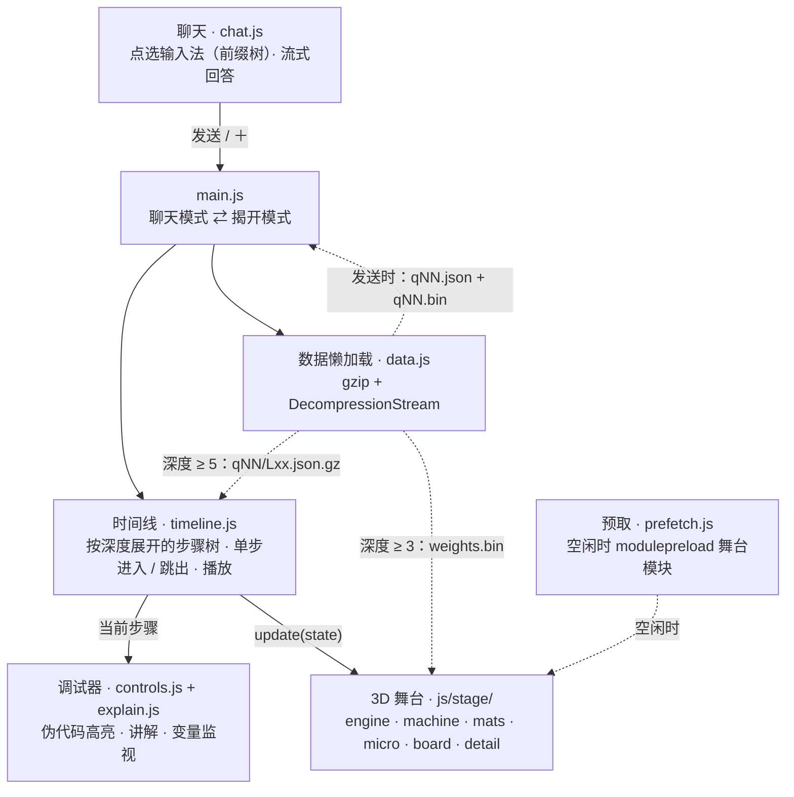

- **步骤树**：一次生成被拆成一棵按深度展开的树，深度越大步子越细；＋ / − 就是调试器的单步进入 / 跳出，切换深度时停在同一位置。
- **舞台是纯函数**：机器的一切都由 `update(state)` 根据当前调试步骤算出来，所以暂停、单步、回退都能正确显示。
- **数据分三块懒加载**：主文件在发出问题、回答开始流式输出时就在后台取；“一次乘加”按层分块，停在第 L 层时预取第 L 层和上下相邻两层；权重缩略图到深度 ≥ 3 才取。
- **首屏轻**：聊天页可交互后，趁空闲用 `modulepreload` 一次性取回舞台的整张模块图（省流量 / 2G 时跳过）；标题字体按“首屏用字 / 其余用字”拆成两个子集，用 `unicode-range` 按需下载。

<details>
<summary><b>推理页数据怎么载入</b></summary>

网页载入的数据分三块（前两块按问题，第三块所有问题共用）：

- **主文件** `qNN.json` + `qNN.bin`：发出问题、回答开始流式输出时就在后台取（gz 后 60–320 KB），点 ＋ 时一般已经到了；
- **“一次乘加”的分块** `qNN/L00.json.gz` … `qNN/L27.json.gz`：每层一个文件，装着这一层所有生成词元的乘加数据（每个 8–41 KB，一个问题 28 层合计 0.2–1.1 MB）。分块**只存 .gz**，不存原始文件；浏览器不支持 `DecompressionStream` 时看不到 D6 的乘加细节（会提示“当前浏览器不支持解压”），其余深度不受影响。网页按需载入：深度 ≥ 5 停在第 L 层时，预取第 L 层和上下相邻两层；真走进某层的 D6 而数据还没到，时间线就在这一步原地等（舞台先画上一级，顶部提示“正在载入第 L 层的乘加数据…”），到了再继续；
- **权重缩略图** `weights.bin`（gz 后约 380 KB）：只有拆开一层（D4）时才用得到，深度 ≥ 3 时才开始取，没到之前权重面板先用装饰纹理。

多模态页：选图时就在后台取这张图的视觉侧数据，发出问题时取语言侧数据；聊天页空闲时预取 3D 舞台的模块（和推理页共用 `js/prefetch.js`），点 ＋ 时模块和数据并行等待。

</details>

```text
llm-blackbox/
├── public/                  网站本体，部署的就是这个目录
│   ├── index.html           推理页
│   ├── js/
│   │   ├── main.js          聊天模式 / 揭开模式的切换，时间线、舞台、聊天气泡的联动
│   │   ├── chat.js          聊天面板和点选输入法（前缀树）
│   │   ├── timeline.js      调试器核心：按深度展开的步骤树、单步进入 / 跳出、播放
│   │   ├── explain.js       伪代码、每一步的讲解、变量监视（全部用真实数值）
│   │   ├── controls.js      调试器界面
│   │   ├── data.js          读取导出的数据
│   │   ├── prefetch.js      后台预取：空闲时 modulepreload 舞台的整张模块图
│   │   ├── resize.js        左右面板拖动调整宽度（各页面共用）
│   │   ├── insights.js      知识碎片
│   │   ├── audio.js bg.js   WebAudio 即时合成的音效（默认静音）、背景粒子
│   │   ├── stage/           Three.js 舞台：engine 渲染 / 相机 / 拾取，machine 机器本体，
│   │   │                    detail 神经元 / 打分 / 比特，mats 权重面板，
│   │   │                    micro 矩阵乘法显微镜，board D6 / D7 的算式板
│   │   └── vendor/three/    自托管的 Three.js r186
│   ├── data/                推理页数据：qNN.json + qNN.bin、qNN/Lxx.json.gz、weights.bin
│   ├── train/               训练页：2D 画布舞台（js/stage.js）和各层视图（js/scenes/）
│   ├── multimodal/          多模态页：3D 舞台（js/scene.js）和图像监视器（js/monitor.js）
│   ├── agent/               智能体页：编辑器 / 终端回放（js/screen.js）和循环 / 上下文视图
│   ├── learn/               延伸学习页：路线图、资源库、术语表、动手试试（data/*.json、snippets/）
│   ├── world/               世界模型页：游戏（js/game.js）、JS 前向（js/nn.js）、真实世界与梦（js/sim.js）、2D 舞台和各层视图（js/scenes/）；probe/ 是第二章
│   └── fonts/               思源宋体子集、JetBrains Mono（SIL OFL）
├── tools/
│   ├── export_qwen.py       推理页数据导出
│   ├── train/               prep_corpus.py · train_tiny.py · qwen_step.py
│   ├── multimodal/          export_qwen3vl.py · make_images.py · grounding.py · images/
│   ├── agent/               record.py · sandbox/（各任务的初始文件）
│   ├── learn/               check_links.py（延伸学习页的外链检查）· links_checked.json（最近一次结果）
│   ├── world/               game.py · train.py · export_world.py · check_game.mjs · check_nn.mjs · ref/（核对用的参考输出）
│   ├── shot.mjs             截图 / 冒烟测试（playwright-core）
│   ├── subset_fonts.py      字体子集
│   └── stamp.sh deploy.sh   版本号、发布
├── deploy/                  服务器端 post-receive 钩子、初始化脚本、nginx 配置
└── docs/images/             README 配图
```

## 本地运行

纯静态站点，没有构建步骤。页面用 ES Modules 和 `fetch` 读数据，需要经由 HTTP 服务打开：

```bash
cd public && python3 -m http.server 8765
# 打开 http://localhost:8765/ （训练 /train/、多模态 /multimodal/、智能体 /agent/、世界模型 /world/、延伸学习 /learn/）
```

### 重新导出数据

需要 GPU、torch、transformers（5.x 已测试）。模型可从 ModelScope 或 Hugging Face 下载。

```bash
# 推理 → public/data/（另需 safetensors）；英文问题 → public/data/en/
python tools/export_qwen.py --model /path/to/Qwen3-0.6B
python tools/export_qwen.py --model /path/to/Qwen3-0.6B --lang en

# 训练 → public/train/data/（另需 numpy、opencc）
python tools/train/prep_corpus.py --src /path/to/chinese-poetry --out /path/to/poetry-train
python tools/train/train_tiny.py --data /path/to/poetry-train      # 约 5 分钟，显存 < 2 GB
python tools/train/qwen_step.py --model /path/to/Qwen3-0.6B         # 约 6 GB 显存

# 多模态 → public/multimodal/data/（另需 torchvision、Pillow）
python tools/multimodal/make_images.py ...                           # 先画输入图，参数见下
python tools/multimodal/export_qwen3vl.py --model /path/to/Qwen3-VL-2B-Instruct

# 智能体 → public/agent/data/（另需 bubblewrap）
python tools/agent/record.py --model /path/to/Qwen3-4B-Instruct-2507

# 世界模型 → public/world/data/（只要 torch、numpy；采集的画面和检查点放 --work，默认 /mnt/d/cjc/world-model）
python tools/world/train.py                      # 采集 → V → M → C → 导出，RTX 5090 上约 8 分钟
python tools/world/train.py --stage export       # 只用已有的检查点重新导出（还有 collect / vae / rnn / ctrl）
python tools/world/make_game_check.py && node tools/world/check_game.mjs   # 游戏的 Python / JS 两份实现逐像素核对
node tools/world/check_nn.mjs                    # 网页里的 JS 前向和 PyTorch 逐元素核对，结果写进 public/world/data/check.json
```

<details>
<summary><b>更多参数：语料准备、画图、只录一个任务、字体子集</b></summary>

**训练页**

```bash
# 语料（放 D 盘）：全唐诗 poet.tang.*.json → tang/，全宋诗 poet.song.*.json → song/（都在原仓库的“全唐诗”目录里）
python tools/train/prep_corpus.py --src /mnt/d/cjc/datasets/chinese-poetry --out /mnt/d/cjc/datasets/poetry-train
python tools/train/train_tiny.py            # 约 5 分钟，显存 < 2 GB；--export-only 只用上次的记录重新导出
python tools/train/qwen_step.py --model /mnt/d/cjc/model-weights/qwen3/Qwen3-0.6B   # 约 6 GB 显存
python tools/train/split_data.py --from-git <提交>   # 只重新切分：从某个提交里的旧格式整份文件切，不用 GPU
```

<details>
<summary><b>训练页的数据拆分与按需载入</b>（首屏只取 93 KB）</summary>

导出脚本最后都交给 `tools/train/split_data.py`，把数据拆成“首屏小文件 + 按需分块”，写完再读回来和原始数组逐字节、和元数据逐个数核对（只重新排布，不改任何数值）。全部在 `public/train/data/`，gzip 后合计约 1.16 MB：

| 文件 | 内容 | 什么时候取 | 大小（gzip） |
| --- | --- | --- | --- |
| `tiny.json` + `tiny.bin` | 元数据（配置、语料、词表、41 个检查点的标量和生成的诗）、每一步的损失 / 学习率 / 梯度范数、批次第 0 行的字、损失地形 | 首屏 | 43 + 40 KB |
| `qwen.json` | Qwen3 的对话、逐词元概率与前 5 名、两种损失、DPO、改动统计 | 首屏 | 10 KB |
| `tiny/ck00…40.bin` | D1：留出诗的逐字概率与前 5 名、24 个注意力头（只存下三角）、嵌入 PCA、三块权重 / 梯度局部 | 进入 D1、播放或拖到这个检查点 | 每块约 19 KB |
| `tiny/st00…40.bin` | D2–D4：批次第 0 行的概率与前 5 名、更新后的概率、逻辑透镜、残差范数与梯度、张量梯度范数、AdamW 算式 | 进入一步之内 | 每块约 5 KB |
| `tiny/feat.bin` | 4 个权重每 4 步一个点的 w / g / m / v | D2 起提前取（D3 更新要用） | 48 KB |
| `qwen/st0…2.json` | 每一步的逻辑透镜、残差范数 / 梯度、每个参数张量的梯度范数 | 进入 Qwen3 的 D1 时 | 每块 12–15 KB |

首屏文件另留一份未压缩的（给不支持 `DecompressionStream` 的浏览器）；分块只存 `.gz`，这类浏览器里对应的卡片会写明“不支持解压”。浮点数组按字节分面存放（先放所有数的第 0 个字节……），gzip 能多压 10–30%。

页面（`js/data.js` 的 `Loader`、`js/main.js` 的 `plan()`）每帧算出当前画面要用的分块：这一屏要用的立即取，播放方向上后几个检查点、相邻检查点、往下一层要用的排队预取（同时最多 4 个）；首屏字体下完后在浏览器空闲时一块一块地后台预取（省流量模式 / 2G 不预取），约 10 秒（8 Mbps）取完。数据没到时：D1 的卡片单独显示载入占位，或者先拿最近的已到检查点顶上（调暗并标注是第几步）；D2–D4 整屏先显示最近的已到检查点并在顶部标注；播放时缺块就原地等到了再走；提示都延迟 0.25 秒再淡入，数据很快到时不会闪。失败后自动重试（间隔从 4 秒翻倍到 30 秒）。

在本地模拟 8 Mbps / 60 ms（冷缓存）：首屏从 2.2 秒、1.9 MB（其中数据 1.1 MB）降到约 0.7 秒、0.25 MB（数据 93 KB）；首屏后立刻进入各层，第一次要等的分块约 0.1–0.15 秒，在首屏停留几秒后基本不用等。

</details>

**多模态页**

```bash
# 1. 画图（需要 Noto Sans SC 可变字重 TTF 和 Noto Serif SC，SIL OFL）；两张照片见“致谢与许可”
python tools/multimodal/make_images.py --sans NotoSansSC.ttf --serif NotoSerifSC-SemiBold.otf \
    --aldrin Aldrin_Apollo_11_original.jpg --starry Van_Gogh_-_Starry_Night_-_Google_Art_Project.jpg
# 2. 导出（需要 torch、transformers 5.x、torchvision、Pillow）
python tools/multimodal/export_qwen3vl.py --model /path/to/Qwen3-VL-2B-Instruct
# 可选：对准层分析
python tools/multimodal/grounding.py
```

`tools/multimodal/images/` 里是导出脚本的输入，`public/multimodal/data/img/` 是模型实际看到的缩放结果。`shapes.png`、`apples.png`、`poem.png`、`chart.png`、`night.png` 是 `make_images.py` 用 PIL 画的（诗笺用 Noto Serif SC，柱状图用 Noto Sans SC）。

**智能体页**（需要 GPU、bubblewrap）

```bash
python tools/agent/record.py --model /path/to/Qwen3-4B-Instruct-2507               # 录全部任务
python tools/agent/record.py --model ... --only fix-median --seeds 0,1,2            # 只录一个
python tools/agent/record.py --model ... --dry                                       # 只看结果不写文件
python tools/agent/record.py --model ... --chips-only                                # 只重建输入法候选
```

**字体子集**：标题用的衬线体（思源宋体，SIL OFL）每个字重拆成两个子集：`-core` 只含首屏一定会用到的字（所有页面 HTML 里的静态文字、开场卡片的大标题、任务卡片等；600 约 60 KB、900 约 20 KB），`-ext` 是其余的字。CSS 用 `unicode-range` 声明两段，页面真的渲染到 ext 里的字时浏览器才去下载它。改了页面上的中文文案后，重新生成字体子集（脚本会同时改写 `css/app.css` 和 `train/css/train.css` 里的 `@font-face`；延伸学习页从 `learn/data/*.json` 渲染的站名、术语名也会收进 ext）：

```bash
python tools/subset_fonts.py NotoSerifSC-Black.otf NotoSerifSC-SemiBold.otf
```

</details>

### 部署

服务器上有 bare 仓库 `/srv/blackbox/repo.git`。推送 `main` 后，[`deploy/post-receive`](deploy/post-receive) 钩子导出 `public/`、给 CSS/JS 加 `?v=<commit>`、放进 `/srv/blackbox/releases/<时间>-<commit>/` 并原子切换 `/srv/blackbox/current`；博客根目录下的 `blackbox` 软链接指向它，保留最近 5 个版本。nginx 只需要 include 一个片段 [`deploy/nginx-blackbox.conf`](deploy/nginx-blackbox.conf)（文本资源 gzip、带版本号的 JS/CSS/字体 30 天缓存、把 `/blackbox/api/` 转给访问计数服务 [`deploy/counter/`](deploy/counter/)）。初始化脚本见 [`deploy/`](deploy/)。

```bash
git remote add deploy <用户>@<服务器>:/srv/blackbox/repo.git   # 只需一次
git push deploy main                                               # 发布（或 sh tools/deploy.sh）
```

更早的版本保存在 git 标签里：`v1`（九个深度的分页式下潜）、`v2`（聊天 + 调试器初版）、`v3`（微观展开版，加训练 / 多模态 / 智能体三页之前）。

## 推理视频

`tools/video/` 用网站的 3D 舞台和真实数据做了一支 3 分 40 秒的片子《AI 的一个字是怎么思考出来的——走进大模型推理的“黑箱”》。问题是「天空为什么是蓝色的？」。

片子从一个干净的聊天页开始：用拼音一个字一个字打出问题，按发送，问题变成消息气泡，助手显示“正在思考…”。接着镜头推近气泡，文字按真实分词裂成词元块，变成 3D 方块飞进黑箱、落到托盘上（一个连续跟随镜头），片名落在黑箱正面。之后依次是：

- 查表：嵌入；
- 穿过 28 层：逻辑透镜在第 21 层说「因为」，第 24 层改口成「天空」；
- 注意力：拆开第 24 层，用“在图书馆查资料”讲 Q / K / V，公式 softmax(QKᵀ/√d)·V 随画面一项一项搭出来，每一项都配真实数字，再并排看 6 个头；
- 前馈：每个词自己消化、联想；结构看得见（1024 → 3072 → 1024），门（gate）决定放多少、内容（up）是放什么，两者相乘，down 收回 1024 个数加回去，SiLU 曲线一闪，这次 3072 个开关只亮了 67 个；
- 选字：28 层走完，最后一个位置的向量和词表里 15 万个词逐一比较打分，softmax 变成概率，只在最靠谱的几个里按概率抽签，说出口、接回句子再算下一个；第 2 个字抽中了不是第一名的「之所以」；
- 写完整句（蒙太奇）；
- 收尾：推理页的真实录屏（点选问题发送 → 点 ＋ 揭开黑箱 → 一层层往里钻 → 播放 / 倍速 / 暂停 / 单步），落版网址和二维码。

全片只演示一次逐数计算（注意力里的一次点积）。讲解的写法是一次只讲一件事：顶部有一条很小的章节进度条；任何时刻最多一行白话字幕，加一个小号术语标签；正在讲的东西用高亮或指示环点出来，其他压暗。配乐由 `compose.py` 用 numpy / scipy 现场合成，讲解段落更安静。

| 文件 | 作用 |
| --- | --- |
| `film.html` / `film.js` / `film.css` / `board.css` | 电影模式页面：复用 `public/js/stage/` 的机器和算式板，`__film.renderAt(t)` 确定地渲染第 t 秒；讲解层（进度条、术语标签、注意力公式板、6 个头的小图、指示环）也在这里 |
| `score.js` | 分镜表：每个镜头的机器状态、机位（样条 + 单调三次插值）、字幕、术语标签、章节进度、配乐事件（96 BPM，段落卡在小节线上） |
| `lib/` | 渲染器（多重采样、泛光、景深）、运镜工具、叠加层；`opening.js` 是开场：聊天页（打字、输入法候选、气泡、推近、裂成词元），以及词元交给 3D 方块以后的飞行与落位 |
| `render.mjs` | 无头 Chromium 逐帧截图（WSL 下走 Mesa d3d12 用 GPU），也能抽单帧、导出事件、出封面；WebGL 上下文丢失（GPU 进程崩溃）时自动重开浏览器重渲 |
| `compose.py` | 原创配乐：铺底、琶音、贝斯、鼓、钟和音效，按 `events.json` 对齐画面；母带 −14 LUFS、真峰值 −2 dBTP |
| `make_qr.py` / `qr-blackbox.svg` | 片尾二维码：用 segno 在本地生成，指向 caijiechao.com/blackbox/ |
| `sitecap.mjs` | 片尾用的推理页录屏：无头 Chromium 打开 `public/index.html`，像用户一样点一遍，用 CDP screencast 录下来，重采样成 30 fps 的帧序列（放 D 盘 `sitecap/`）和点击时间表 `meta.json`；电影页按时间表剪辑、变速、叠加鼠标 |
| `encode.sh` | 帧 + 配乐 → H.264（crf 18、slow、yuv420p、+faststart）+ AAC 192k |
| `share.sh` | 分享用小体积版本：1080p30，两遍编码，码率按片长算到 ≤150 MB（3:35 用 4.8 Mbps） |
| `review.py` | 抽帧拼成带时间码的联系表，检查用 |
| `dbg.mjs` | 调试：跳到第 t 秒，在页面里执行一段表达式（可顺带截图） |
| `serve.py` | 本地服务器（仓库根目录 + D 盘上的字体） |

重新生成（帧序列、配乐、成片都放 D 盘，不放仓库里）：

```bash
# 需要 /mnt/d/cjc/videos/llm-inference/fonts/ 下的 NotoSerifSC-{Black,SemiBold}.otf 和 NotoSansSC-VF.ttf（都是 SIL OFL）
python tools/video/serve.py --port 8776 &
O=/mnt/d/cjc/videos/llm-inference
/mnt/d/cjc/venvs/blackbox/bin/python tools/video/make_qr.py                 # 只在网址变了时需要（uv pip install segno）
node tools/video/sitecap.mjs --out $O/sitecap                                # 片尾的推理页录屏（只在网页改版时需要重录）
node tools/video/render.mjs frames --out $O/frames60 --fps 60 --workers 4   # 约 3 分钟；已有的帧会跳过，中断了可以接着渲
node tools/video/render.mjs events --out tools/video/events.json
/mnt/d/cjc/venvs/blackbox/bin/python tools/video/compose.py --events tools/video/events.json --out $O/score.wav
bash tools/video/encode.sh $O/frames60 $O/score.wav $O/qwen3-inference-v7.mp4 60
bash tools/video/share.sh $O/frames60 $O/score.wav $O/qwen3-inference-v7-share.mp4
node tools/video/render.mjs poster --out $O/poster-v7.png                   # 默认取片名落版那一刻
python tools/video/review.py --frames $O/frames60 --fps 60 --every 2 --out $O/review   # 可选：联系表
```

浏览器里预览：<http://127.0.0.1:8776/tools/video/film.html?preview&t=0>（拖时间轴、空格暂停）。`render.mjs` 依赖 playwright-core，并把 `LD_LIBRARY_PATH` 指向 chromium 的依赖库（脚本里写好了这台 WSL 的路径）。

## 致谢与许可

- **模型**：[Qwen3-0.6B](https://huggingface.co/Qwen/Qwen3-0.6B)、[Qwen3-VL-2B-Instruct](https://huggingface.co/Qwen/Qwen3-VL-2B-Instruct)、[Qwen3-4B-Instruct-2507](https://huggingface.co/Qwen/Qwen3-4B-Instruct-2507)，阿里巴巴通义千问团队开源，Apache-2.0。仓库里只有从它们导出的部分数值（概率、激活、少量权重和权重分布缩略图），不含完整权重。
- **[Three.js](https://threejs.org/)** r186，MIT，自托管在 `public/js/vendor/three/`。
- **字体**：[Noto Serif SC](https://github.com/notofonts/noto-cjk)（思源宋体，© Google / Adobe）和 [JetBrains Mono](https://github.com/JetBrains/JetBrainsMono)（© JetBrains），SIL Open Font License 1.1，见 [`public/fonts/LICENSE.txt`](public/fonts/LICENSE.txt)。
- **语料**：[chinese-poetry](https://github.com/chinese-poetry/chinese-poetry)，MIT 许可，诗歌本身属公有领域。
- **照片**（均为公共领域，缩小到长边 640 像素后存入仓库）：
  - `moon.jpg`：*Aldrin Apollo 11*（AS11-40-5903），Neil Armstrong / NASA 拍摄。来源：[Wikimedia Commons](https://commons.wikimedia.org/wiki/File:Aldrin_Apollo_11_original.jpg)
  - `starry.jpg`：*The Starry Night*（1889），Vincent van Gogh。来源：[Wikimedia Commons](https://commons.wikimedia.org/wiki/File:Van_Gogh_-_Starry_Night_-_Google_Art_Project.jpg)

本仓库自身的代码与内容暂未附许可证文件（许可证待定）；上面列出的第三方资源各按其原许可。

## 世界模型页 · 大模型里的世界地图

世界模型页（`public/world/`）的第二章，独立模块在 `public/world/probe/`：复现 Gurnee & Tegmark 2023《[Language Models Represent Space and Time](https://arxiv.org/abs/2310.02207)》，看 Qwen3-0.6B 的隐状态里能不能**线性地**读出一个城市在地球上的位置。模型只读过文字，从没见过地图。

- **模块接口**：`probe.js` 导出 `mountProbe(el, { onExplain(html) })`，返回 `{ setLayer(L), destroy() }`；样式 `probe.css` 由模块自己插入，类名都带 `pb-` 前缀；`probe/dev.html` 是单独测试用的开发页。
- **页面上能做什么**：层滑杆 / 播放（第 0 → 27 层，点从平均位置散开、一层层分出各大洲）；R² 随层变化的曲线（兼作滑杆，附论文 Llama-2-7B 的参照线）；悬停看一个城市的真实位置、探针以为的位置和误差；按大洲 / 按误差着色，点图例只看一个大洲；切换四组探针（问坐标 / 只给名字 / 对照 · 打乱标签 / 对照 · 未训练）；“算式”面板把 40 个知名城市在任意一层的读数写成 b + Σ (h[i] − h̄[i]) × w[i]（贡献最大的 12 维 + 其余 1,012 维的合计，和推理页算式板同一套配色）。

**数据与许可**

- 城市：[GeoNames](https://www.geonames.org/) 的 `cities15000` + `countryInfo.txt`（[CC BY 4.0](https://creativecommons.org/licenses/by/4.0/)，2026-10 下载）。清洗：只留有人居住的地点（去掉城区片区、历史 / 废弃地点）；名字里有 Latin-1 以外的字符时用 GeoNames 的 ASCII 写法；同名城市按论文处理美国地名的规则，最大的人口不到第二大的 2 倍就整组丢掉（比如 “Valencia”）；论文按维基百科浏览量去掉冷门地点，这里用 GeoNames 的别名数（≥ 10）代替；每个国家最多 80 个、各大洲按人口取名额，共 **3,755 个城市**（亚洲 1,350、欧洲 850、非洲 650、南美 400、北美 395、大洋洲 110）。俄罗斯东经 60° 以东算亚洲。
- 海岸线：[Natural Earth](https://www.naturalearthdata.com/) 1:110m 陆地多边形（公共领域），量化到 0.1°。
- 国家的中文名：Unicode CLDR（经 [Babel](https://babel.pocoo.org/)，Unicode License）；台湾、香港、澳门写作“中国台湾 / 中国香港 / 中国澳门”。
- 网页地图右下角标注了 GeoNames（CC BY 4.0）和 Natural Earth。

**方法**（`tools/world/probe_export.py`）

- 每个城市单独喂给 Qwen3-0.6B（fp32），用论文仓库里 world_place 的两种模板：`What are the lat/lon coordinates of <城市名>`（论文 3.3 节问坐标的提示，页面默认）和只有城市名（论文主实验）。开头加 `<|endoftext|>` 代替 Llama-2 的 BOS——不加的话，单个词元的名字会落在第 0 个位置，那里从第 2 层起范数暴涨到约 6,500（注意力汇点）。
- 取**城市名最后一个词元**在 28 层每层输出处的残差流（1,024 维）。
- 每层一个岭回归探针预测（纬度, 经度）：带截距，目标标准化，λ 在训练集上用高效留一交叉验证从 10⁻¹–10⁷ 的 33 个候选里选（和论文用的 sklearn `RidgeCV` 同一个公式，两个目标共用 λ；选中的 λ 都没顶到边）。
- **5 折交叉**：每个城市都由没见过它的那一折探针来预测，所以地图上 3,755 个点全是测试集预测。指标：R²（纬度、经度各算再平均，同论文）、到真实位置的大圆距离、论文的邻近误差（随机猜为 0.5）。
- 对照：① **打乱标签**——训练集里城市和坐标随机配对，探针其余不变；② **未训练的模型**——同结构、随机初始化（种子 0，std 0.02）的 Qwen3-0.6B，同样的提示和探针。
- 按国家整块留出（论文 4.1 节）：在最好的一层，对城市数 ≥ 20 的 60 个国家逐个“一个都不给探针看”再预测。
- 算式：40 个知名城市在每一层的预测 = 训练城市的平均位置 b + Σ (h[i] − h̄[i]) × w[i]，导出贡献最大的 12 维、其余维的合计、正负乘积之和与按贡献排序的累计和；脚本核对加起来正好等于探针的预测。

**结果**（全部是测试集上的数字）

| 层 | 问坐标 R² | 平均 / 中位误差 | 只给名字 R² | 打乱标签 R² | 未训练 R² |
| --: | --: | --: | --: | --: | --: |
| 0 | 0.296 | 4,731 / 3,782 km | 0.277 | −0.001 | 0.067 |
| 4 | 0.474 | 4,062 / 3,272 km | 0.418 | 0.000 | 0.074 |
| 8 | 0.555 | 3,649 / 2,770 km | 0.445 | 0.000 | 0.073 |
| 10 | 0.596 | 3,376 / 2,511 km | 0.461 | 0.000 | 0.072 |
| 18 | 0.590 | 3,396 / 2,498 km | 0.455 | −0.002 | 0.070 |
| 22 | 0.618 | 3,163 / 2,208 km | 0.473 | −0.005 | 0.068 |
| 27 | **0.620** | **3,104 / 2,129 km** | 0.466 | −0.008 | 0.066 |

- 最好的一层：问坐标第 27 层 R² 0.620（纬度 0.58、经度 0.66），邻近误差 0.153；只给名字是第 24 层 0.474（平均 3,816 km）。和论文一样，前一半的层迅速变好（第 3 → 10 层 0.39 → 0.60），之后基本是平台。嵌入层本身是 0.24。
- 对照：打乱标签每一层的 R² 都在 −0.008 到 0.001 之间（平均误差约 6,200 km，点全部塌向平均位置）；未训练的模型最好 0.076——名字的拼写本身只带一点线索。
- 哪里准（第 27 层中位误差）：欧洲 1,286 km、亚洲 1,822、非洲 2,405、南美 3,932、北美 3,978、大洋洲 8,950 km。读不准时，岭回归会把预测拉向所有城市的平均位置（北纬 23°、东经 25°，撒哈拉一带），离得越远的地方被拉得越远；经度在 ±180° 处断开，太平洋岛国的连线会横穿整张地图。
- 按国家留出：60 国的平均误差 3,132 → 3,867 km，邻近误差 0.153 → 0.191（论文 Llama-2-7B：0.071 → 0.170）。
- 比论文差很多：论文里 Llama-2-7B 在 60% 深度的 R² 是 0.881（70B 是 0.911）；6 亿参数的小模型能读出大致方位，离“精确的地图”还很远。线性探针能读出来 ≠ 模型在用它，论文另做的干预实验这里没有做。

**数据量**：`probe.json`（城市、指标、海岸线）98 KB gz；`pred.bin`（4 组 × 28 层 × 3,755 城的预测，int16 / 0.1°，沿层差分 + 按字节分面）796 KB gz；算式 40 个城市各一个 `formula/<GeoNames 编号>.json.gz`（共 506 KB，只在打开算式面板时才取）。合计约 1.4 MB gz。

**重新生成**（隐状态缓存在 D 盘，3 份共 1.3 GB；GPU 峰值约 3.3 GB）：

```bash
PY=/mnt/d/cjc/venvs/blackbox/bin/python                      # 另需 babel（国家中文名）
$PY tools/world/probe_data.py                                 # 下载 GeoNames / Natural Earth → /mnt/d/cjc/world-model/probe/{cities.tsv,land.json}
$PY tools/world/probe_export.py --model /mnt/d/cjc/model-weights/qwen3/Qwen3-0.6B   # 约 11 分钟 → public/world/probe/data/
$PY tools/world/probe_export.py --skip-acts                   # 隐状态已缓存时只重算探针和导出
```
